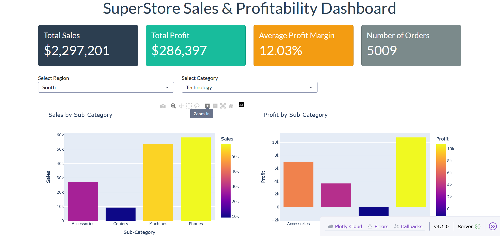
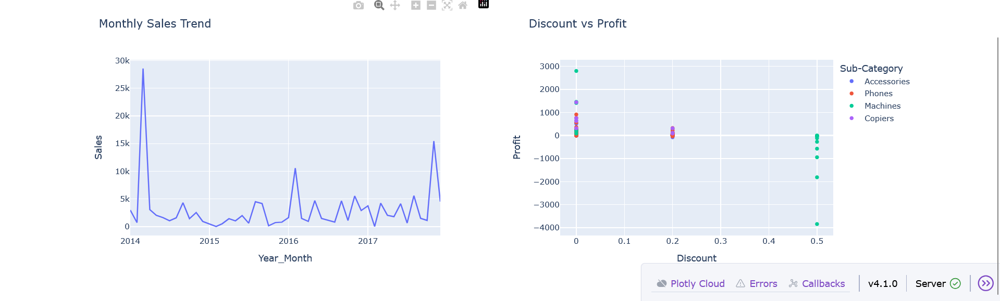
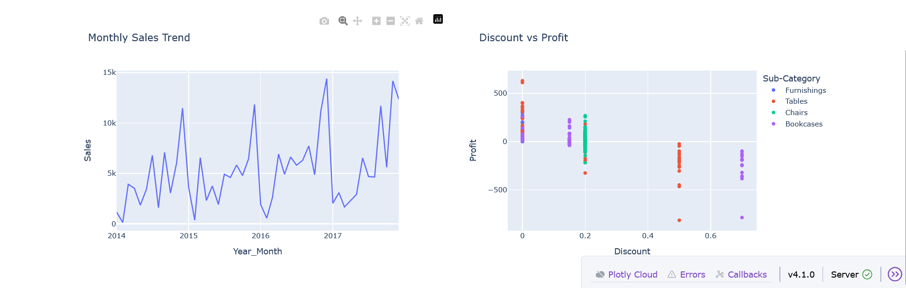
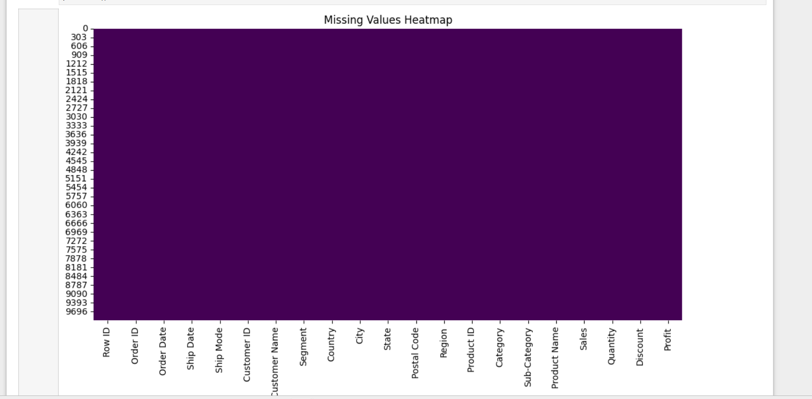

# SuperStore Sales & Profitability Dashboard

## Project Overview
This project analyses SuperStore sales data using Python, Pandas, Seaborn, Matplotlib, Plotly, and Dash.

The project includes:
- Data cleaning
- Exploratory Data Analysis (EDA)
- Interactive dashboard development
- Sales and profitability analysis
- Regional and category-based insights

## Technologies Used
- Python
- Pandas
- NumPy
- Matplotlib
- Seaborn
- Plotly
- Dash

## Features
- KPI cards for sales, profit, and orders
- Interactive region and category filters
- Sales by sub-category analysis
- Profit by sub-category analysis
- Monthly sales trends
- Discount vs Profit relationship analysis

## Dashboard Screenshots

### Main Dashboard


### Dashboard Charts


### Dashboard Trends


### Heatmap Analysis


## Project Structure

```bash
assets/
screenshots/
app.py
requirements.txt
SuperStore_Analytics_Dashboard.ipynb
Sample - Superstore.csv
```

## How to Run

Install requirements:

```bash
pip install -r requirements.txt
```

Run the dashboard:

```bash
python app.py
```

Open:
```bash
http://127.0.0.1:8050
```

## Skills Demonstrated
- Data Cleaning
- Data Visualization
- Dashboard Development
- Exploratory Data Analysis
- Business Intelligence
- Interactive Filtering
- Python Programming
